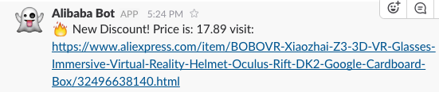

# Alibaba Price Alert
[](https://deploy.now.sh/?repo=https://github.com/apertureless/micro-service-testing)
[](https://github.com/sindresorhus/xo)

Small service that crawls a aliexpress uri and get the discount price.
Saves it up and sends a slack notification if it's the cheapest price currently discovered.

This way you can easy watch certain products and snipe the biggest discount!

## Features
- Crawls Aliexpress URI
- Gather discount price of article
- Saves prices in array
- Sends slack notification if cheapest price in array

## Env

```
REFRESH_TIME = 60
SLACK_WEBHOOK_URL = ''
URL = 'https://www.aliexpress.com/{articleurl}'
```

## Deploy

Can be deployed with `now`.
Just set the env vars.
